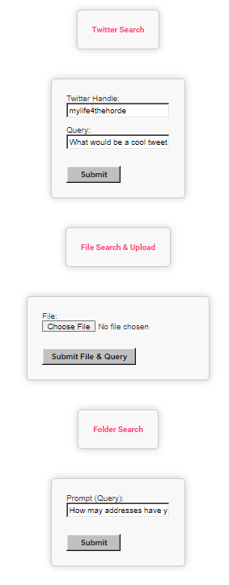

# llama-index flask demo

### Screenshots



### Notes
Implementing https://github.com/jerryjliu/gpt_index and their connectors (in this example twitter from [llama-hub](https://llamahub.ai/)  [twitter_loader](https://github.com/emptycrown/llama-hub/tree/main/loader_hub/twitter) in a flask application for prototyping and demo. Needs more work for additional prompt saving. Credits to [jdan](https://github.com/jdan/98.css ) for the CSS.


### Requires OpenAI API Key & Twitter Developer Key (Bearer Token)

## install

```
git clone https://github.com/mewmix/llama-index-flask-demo && cd llama-index-flask-demo


pip install -r requirements.txt

```

## edit the server.py file with your keys and then run.


```
python3 server.py

```

### Go to  browser

http://127.0.0.1:5000/


### example prompt

```
What would be a trendy summary tweet based on this user? 

```


### File upload requires data (supporting docx) in the /data/ folder
# llama-index-flask-demo
